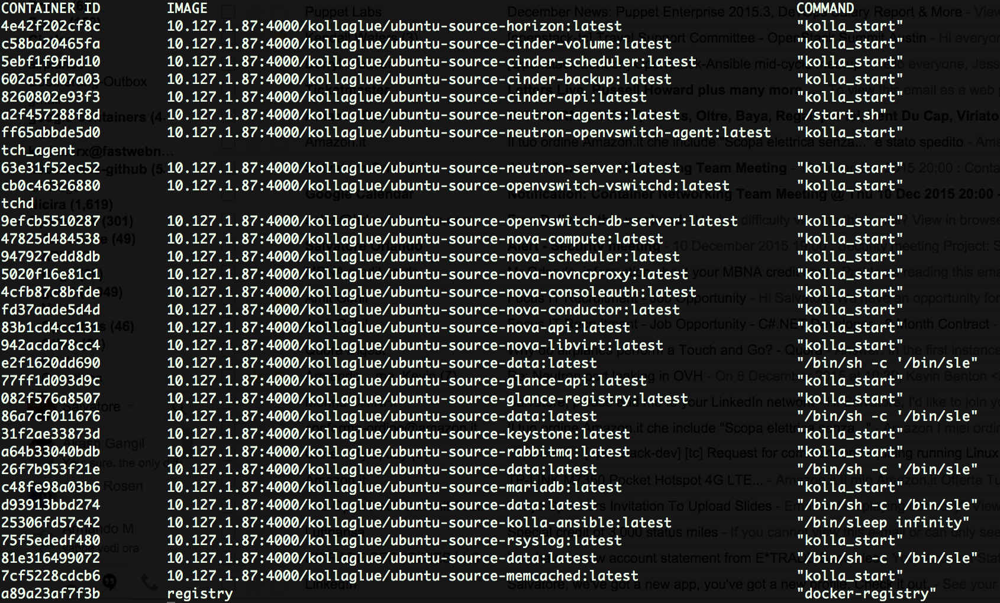

OpenStack developers typically employ devstack to setup their development
environment.
From time to time, especially when whole mornings are spent solving crazy
the dependency issues in the development environment, it might happen that
one wonders what alternatives there are out there.

The _executive answer_ here is: not much for now, but maybe things can change
in the future. For the time being be happy with devstack and be aware that
destroying and rebuilding your dev env with tools like
[devstack-vagrant](https://github.com/openstack-dev/devstack-vagrant) is often
quicker than fixing it.
 
In the rest of this heap of pseudo-random thoughts discusses how to use
Kolla, a project providing tools for deploying, running, and managing OpenStack
services in containers, for doing OpenStack development.

This is a rather long read. Those in a hurry can use the following links to
jump to the article's *juicy bits*

* [Building Docker images](#build_image)
* [Deploying OpenStack services in containers](#deploy)
* [Doing code development on Kolla deployments](#develop)

### Introduction to Kolla

It does not often happen that an OpenStack project has a scope so well defined
as it is with Kolla: simplifying the process of deploying and operating
OpenStack clouds. For readers who are already familiar with the OpenStack
ecosystem there is a wide range addressing this specific issue; just to mention
some of them: [Fuel](https://wiki.openstack.org/wiki/Fuel),
[TripleO](https://wiki.openstack.org/wiki/TripleO), or
[Juju](https://jujucharms.com/openstack) - the list could go on and on as this
seem to be a space that is never crowded enough; anyway it is better to move on,
as this is not at all about deploying OpenStack.

Kolla, whose name means "Glue" in Greek, and, unsurprisingly, in Italian as
well (it's just spelled 'Colla'), is a rather active, albeit relatively
young OpenStack project.

In a nutshell, it does two simple things:

1. Building docker images for OpenStack services (`kolla-build`)
2. Deploying said containers and configuring OpenStack services
   (`kolla-ansible`)

Currently [ansible](https://github.com/ansible/ansible) takes care of the
service provisioning part. Needless to say, this does not mean that ansible
is _the only_ way of provisioning these containers. Indeed an
[alternative](https://github.com/openstack/kolla-mesos) leveraging mesos
is already in the works.


### Building and Deploying OpenStack images

This article follows the process outlined in the [bare metal deployment guide](
http://docs.openstack.org/developer/kolla/quickstart.html), even if the
deployment will actually be performed on an Ubuntu VM, running on a
OpenStack cloud. It is however important to note that the Kolla development
team also provides different deployment options for development and evaluation
environments leveraging either on [Heat](http://docs.openstack.org/developer/kolla/heat-dev-env.html)
or [Vagrant](http://docs.openstack.org/developer/kolla/vagrant-dev-env.html).

#### Prerequisites

Obviously the first step are the prerequisites, and since this stuff is going
to run in containers, maybe we might want to install Docker. On this regard
there are 2 things to keep in mind:

1. Kolla is currently (2015-11-30) pinned at Docker 1.8.2; apparently the reason for
   this is a rather wild [Docker API change](
   https://github.com/docker/docker/commit/9098628b2901ae8585ba4c66ee6e14759d2119da)
   which caused a failure in the [Ansible Docker Module](
   https://github.com/ansible/ansible-modules-core/pull/2258)
2. The Kolla development community advises running Docker with the BTRFS file
   system; therefore Docker should be configured accordingly


```bash
$ sudo apt-get install btrfs-tools
$ sudo mkfs.btrfs /dev/vdb
$ blkid | grep btrfs
/dev/vdb: UUID="c45d90d0-afed-4a0f-af84-66ac7b65dd63" UUID_SUB="5da5e79a-9a64-491e-b5ff-bd1408e36073" TYPE="btrfs" 
$ sudo vi /etc/fstab
# add an entry for /dev/vdb
$ cat /etc/fstab | grep btrfs
UUID=c45d90d0-afed-4a0f-af84-66ac7b65dd63 /var/lib/docker btrfs defaults  0 1
$ sudo curl -sSL https://get.docker.com/ | sh
$ sudo apt-get install docker-engine=1.8.2-0~trusty
$ sudo usermod -aG docker <yournamehere>
# Edit docker options for BTRFS(Ubuntu-specific)
$ sudo vi /etc/default/docker
$ cat /etc/default/docker | grep DOCKER_OPTS
# Use DOCKER_OPTS to modify the daemon startup options.
DOCKER_OPTS="-s btrfs"
```

Installing Docker's latest release and then downgrading to 1.8.2 is a bit
wasteful but still convenient because of all the heavy lifting done in the
script. Alternatively one can always edit the script replacing the line
for downloading and installing the latest release with that for installing
1.8.2.

Once Docker is sorted, it's time to think about the other big boy: ansible.
Don't even bother with apt-get as the Ubuntu repos for both Trusty and Vivid
have version which are too old for Kolla. pip is your friend here.

```bash
$ sudo pip install ansible==1.9.4
```

Ansible 1.9.4 is known to work just fine with kolla, whereas there are
reports of breakages with ansible>=2.0.0.

In order to run Kolla few more packages need to be installed:

```bash
$ sudo apt-get install -y gcc python-dev libffi-dev python-openstackclient
```

As Kolla will spin a container specific for libvirt, the service running on
the host must be disabled. Likewise, it is worth disabling apparmor as well,
as it triggered issues with the rabbitmq container.

```bash
$ sudo su
$ service libvirt-bin stop
$ update-rc.d libvirt-bin disable
$ service apparmor teardown
$ update-rc.d apparmor disable
``` 

#### The Docker registry

The host machine is now ready for Kolla.
However it is a good practice to install a local registry rather than
relying on the *Docker Hub*. In particular a local registry is required
when doing multinode installations.

The Docker Registry can be installed in several ways. The Kolla team
recommends running the v1 registry as image push performance on the v2
registry is not satisfactory.

The easiest way for running the Docker registry is to run it in... a
Docker container!

```bash
$ docker run -d -p 4000:5000 --restart=always --name registry -v `pwd`/data:/var/lib/docker-registry registry
```

This will run the docker registry in a container, expose the service on port
4000, and store all data in /var/lib/docker, which might be mounted on a
separate device, even if it uses only ~10MB for Kolla images' data.
Testing the Docker registry is straightforward as well:

```bash
$ curl -sSL localhost:4000
"\"docker-registry server\""
```

To run the v2 Docker registry, just pull the v2 image: `registry:2`

And, if for some reason running the registry in a container is not an option
it is still possible to run the now Deprecated "old" python registry. The
Kolla documentation has the instructions for CentOs, but a reliable guide for
Ubuntu is available [here](https://www.digitalocean.com/community/tutorials/how-to-set-up-a-private-docker-registry-on-ubuntu-14-04)

#### Build OpenStack images  <a id="build_image"></a> 

Everything is now ready for creating Docker images for OpenStack services with
the `kolla-build` tool.
For building images it is necessary to specify a few settings, like the base
image or whether create images from release or sources. These settings can
either be passed as command-line options to `kolla-build` or specified in the
`kolla-build.conf` file (typically located in `/etc/kolla`).

In the `kolla-build` section:

* `base = ubuntu`
* `install_type = source` (that's the only available option for Ubuntu)
* `registry = localhost:4000` (as we're doing a single-node installation
this is fine) 
* `push = True` (push image to Docker registry after building it)
* `debug = True` (not necessary but always useful)

The `profile` section defines a list of collection of services that can
be used for various purposes. These profiles are discussed in a separate
section. For the purpose of this demo a new profile with a minimal set of
services is created, in order to minimise the time required to build and
deploy these containers.

Finally, since the goal here is use Kolla as a development environment,
the location for the OpenStack services source code must be updated, as,
by default, they point to release tarballs.
For instance, the following specifies local repositories and branches
for nova and neutron development. The `location` parameter specifies the
location of the git repository whereas the `reference` parameter specifies
with branch should be used.

```
[neutron-base]
type = git
location = file:///home/salvatore/openstack/neutron
reference=test_devel

[nova-base]
type = git
location = file:///home/salvatore/openstack/nova
reference=master
```

The image building process can now start.

```bash
$ kolla-build -p infra_light
$ kolla-build -p light
```

The **-p** option allows users to specify a Kolla profile. The first command
builds 'infrastructure' containers images, such as the database server,
or the AMQP server. The second command instead builds images for OpenStack
services.
It is worth noting that one does not have to use Kolla profiles. It is
indeed also possible building single images, for instance:

```bash
kolla-build neutron-server
kolla-build nova-api
```

After a good wait (the first build really takes a while... it's not a bad
idea to launch it before going out for lunch. With a bit of luck the operation
will complete without any hiccup, and the `docker images` output will look
like the following:

```
REPOSITORY                                                           TAG                 IMAGE ID            CREATED             VIRTUAL SIZE
localhost:4000/kollaglue/ubuntu-source-neutron-openvswitch-agent     latest              3774e1c4d849        18 minutes ago      634.5 MB
localhost:4000/kollaglue/ubuntu-source-neutron-base                  latest              7dcaf6015231        18 minutes ago      634.5 MB
localhost:4000/kollaglue/ubuntu-source-kolla-ansible                 latest              861e79f60f3e        20 minutes ago      545.8 MB
localhost:4000/kollaglue/ubuntu-source-openstack-base                latest              6516f6858e0f        21 minutes ago      500.9 MB
localhost:4000/kollaglue/ubuntu-source-ceph-mon                      latest              62dce69bfece        23 minutes ago      372.3 MB
localhost:4000/kollaglue/ubuntu-source-ceph-osd                      latest              bc833003a1a4        23 minutes ago      372.3 MB
localhost:4000/kollaglue/ubuntu-source-ceph-base                     latest              466f1aeb4d50        24 minutes ago      372.3 MB
localhost:4000/kollaglue/ubuntu-source-rabbitmq                      latest              6e61fb755b6c        24 minutes ago      268.4 MB
localhost:4000/kollaglue/ubuntu-source-mariadb                       latest              0fd767952470        25 minutes ago      401.8 MB
localhost:4000/kollaglue/ubuntu-source-openvswitch-vswitchd          latest              60d9b724dcdc        26 minutes ago      238.5 MB
localhost:4000/kollaglue/ubuntu-source-openvswitch-db-server         latest              7b2305af0c1c        26 minutes ago      238.5 MB
localhost:4000/kollaglue/ubuntu-source-openvswitch-base              latest              12ca22a1d5ef        27 minutes ago      238.5 MB
localhost:4000/kollaglue/ubuntu-source-memcached                     latest              cadb45b7a4b1        27 minutes ago      230.9 MB
localhost:4000/kollaglue/ubuntu-source-base                          latest              074de77fa890        27 minutes ago      229.3 MB
localhost:4000/kollaglue/ubuntu-source-data                          latest              0a978d6ed180        29 minutes ago      187.9 MB
ubuntu                                                               latest              d55e68e6cc9c        46 hours ago        187.9 MB
localhost:4000/kollaglue/ubuntu-source-neutron-server                latest              f74699562300        2 weeks ago         633.5 MB
localhost:4000/kollaglue/ubuntu-source-neutron-agents                latest              3badc3ecef0c        2 weeks ago         637.9 MB
localhost:4000/kollaglue/ubuntu-source-neutron-linuxbridge-agent     latest              c9141fecc0cb        2 weeks ago         633.5 MB
localhost:4000/kollaglue/ubuntu-source-rsyslog                       latest              4f3e49dae6dd        3 weeks ago         229.3 MB
localhost:4000/kollaglue/ubuntu-source-cinder-api                    latest              ee642398da45        3 weeks ago         652.6 MB
localhost:4000/kollaglue/ubuntu-source-cinder-scheduler              latest              d96d7e45fd88        3 weeks ago         652.6 MB
localhost:4000/kollaglue/ubuntu-source-cinder-backup                 latest              f558c36824de        3 weeks ago         652.6 MB
localhost:4000/kollaglue/ubuntu-source-cinder-volume                 latest              91fe67807826        3 weeks ago         652.6 MB
localhost:4000/kollaglue/ubuntu-source-horizon                       latest              f7a61911d977        3 weeks ago         644.4 MB
localhost:4000/kollaglue/ubuntu-source-cinder-base                   latest              103f04f4b2f7        3 weeks ago         652.6 MB
localhost:4000/kollaglue/ubuntu-source-nova-libvirt                  latest              bb1f3168a810        3 weeks ago         544.1 MB
localhost:4000/kollaglue/ubuntu-source-keystone                      latest              54a91111411e        3 weeks ago         554.3 MB
localhost:4000/kollaglue/ubuntu-source-glance-api                    latest              7456aea3e354        3 weeks ago         569.5 MB
localhost:4000/kollaglue/ubuntu-source-glance-registry               latest              088a2e72db1e        3 weeks ago         569.5 MB
localhost:4000/kollaglue/ubuntu-source-glance-base                   latest              40c993cc1a9d        3 weeks ago         569.5 MB
localhost:4000/kollaglue/ubuntu-source-nova-compute                  latest              ea1e8f1f8217        3 weeks ago         720.7 MB
localhost:4000/kollaglue/ubuntu-source-nova-api                      latest              09165939d606        3 weeks ago         663.8 MB
localhost:4000/kollaglue/ubuntu-source-nova-novncproxy               latest              181f9ed6af90        3 weeks ago         665.3 MB
localhost:4000/kollaglue/ubuntu-source-nova-spicehtml5proxy          latest              fd5a85f10346        3 weeks ago         664.1 MB
localhost:4000/kollaglue/ubuntu-source-nova-network                  latest              d51e7861fa4a        3 weeks ago         663.8 MB
localhost:4000/kollaglue/ubuntu-source-nova-scheduler                latest              d51e7861fa4a        3 weeks ago         663.8 MB
localhost:4000/kollaglue/ubuntu-source-nova-conductor                latest              d51e7861fa4a        3 weeks ago         663.8 MB
localhost:4000/kollaglue/ubuntu-source-nova-consoleauth              latest              d51e7861fa4a        3 weeks ago         663.8 MB
localhost:4000/kollaglue/ubuntu-source-nova-base                     latest              a9eeb1d0ad4d        3 weeks ago         663.8 MB
registry                                                             latest              acc35f593d3c        4 weeks ago         422.8 MB
```

#### Kolla profiles

Profiles provide an easy way for building images for OpenStack services.
There are a few 'built-in' profiles but it is possible to create any number of
profiles, simply by entering them in `kolla-build.conf`.
For instance for this demo the `infra-light` and `light` profiles were added.

```
[profiles]
infra = ceph,data,mariadb,haproxy,keepalived,kolla-ansible,memcached,mongodb,openvswitch,rabbitmq
infra_light = ceph,data,mariadb,kolla-ansible,memcached,openvswitch,rabbitmq
main = cinder,ceilometer,glance,heat,horizon,keystone,neutron,nova,swift
light = cinder,glance,horizon,keystone,neutron,nova
aux = designate,gnocchi,ironic,magnum,zaqar
default = data,kolla-ansible,glance,haproxy,heat,horizon,keepalived,keystone,memcached,mariadb,neutron,nova,openvswitch,rabbitmq,rsyslog
gate = ceph,cinder,data,dind,glance,haproxy,heat,horizon,keepalived,keystone,kolla-ansible,mariadb,memcached,neutron,nova,openvswitch,rabbitmq,rsyslog
```

Interestingly the profiles which include the `openvswitch` image also happen
to build some Neutron images. This is because Kolla adopts regex matching for
image names and `openvswitch` also matches `neutron-openvswitch-agent` which
in its turn builds the `neutron-base` image. 

#### Deploy OpenStack with Ansible  <a id="deploy"></a>


Docker images for OpenStack services are now ready for deployment; in
particular Neutron and Nova images will run code from local git branches.

The `kolla-ansible` script uses two configuration files:

* `/etc/kolla/passwords.yml` which defines all the passwords for OpenStack
services; as the purpose of this deployment is development, the convenient
default value of "password" satisfies our needs;
* `/etc/kolla/globals.yml` where some important settings, especially
concerning networking, might need to be specified.

For this particular deployment the following settings are specified:

* `kolla_base_distro = ubuntu`, equivalent to 'base' in `kolla_build.conf`;
* `kolla_install_type = source`, equivalent to 'install_type' in
`kolla_build.conf`;
* `docker_registry = localhost:4000`, equivalent to the corresponding parameter
in `kolla_build.conf`;
* `neutron_interface = eth0`; this is the interface that Kolla will use both
for management traffic and for instance traffic in overlay networks;
* `neutron_external_interface = eth1`; this is the interface that will be used
by Neutron for external instance traffic. It has the same role of the network
interface where devstack attaches the br-ex bridge;
* `kolla_internal_address = <kolla_vm_eth0_ip>`; This address could be that
of a VIP load balancing the various instances running `keepalived`; for
single node deployments it should simply be the primary address of the
'management' network interface
* `enable_xxx: (yes|no)`; These options specify which services should be
enabled in the Kolla deployment. If not specified, the default setting
for a given service is chosen. Such defaults are specified in
[`ansible/group_vars/all.yml`](http://git.openstack.org/cgit/openstack/kolla/tree/ansible/group_vars/all.yml).

The deployment process is started with the following command:

```bash
$ sudo kolla-ansible deploy
```

This process can be summarised as follows:
* Deploy containers infrastructure services such as mariadb, memcached,
and rsyslog
* Deploy and configure the Keystone container
* For each enabled OpenStack service, deploy its containers, configure the
service, and update the Keystone service catalogue.

In the VM used for these experiments (8 cores, 16 GB RAM) the process takes
on average about 20 minutes, which is not very different from the rough
numbers for deployment times reported on the Kolla documentation page.
However, for developers used to devstack this is really way too long (not
so much instead for developers used to build large C applications in the
early '90s).

Thankfully Kolla (well, actually Ansible) provides an easy solution for
deploying only what is needed:

```bash
$ sudo ansible-playbook -v -i /usr/local/share/kolla/ansible/inventory/all-in-one -e @/etc/kolla/globals.yml -e @/etc/kolla/passwords.yml /usr/local/share/kolla/ansible/site.yml --tags neutron
```

The command above will deploy only those containers associated with the
**neutron** tag, and takes on average less than 3 minutes on the VM used
for the experiments presented here.

Once the Ansible scripts terminates all the containers should be up and
running, as shown in the screen shot below.



It is however not uncommon to see failures during Kolla Ansible deployment;
in some cases the Ansible script even terminates successfully, but some
containers failed (in particular this happened in a few instances with the
rabbitmq container). When this happens `docker logs <container_name>`
provided enough information to root cause the issue and fix the problem.

In any case, there is always the brute force approach: destroy all container
and re-deploy everything. This is the equivalent of doing `./unstack.sh` and
then again `./stack.sh`, and thankfully is often unnecessary with Kolla.
Obviously it is really recommended to pay some attention and not destroy the
Docker Registry container too. The following command achieves this:

```bash
docker ps -a --no-trunc | awk '!/NAMES| registry/ {print $1}' | xargs docker rm -v -f
```

The OpenStack single-node development environment is now ready for hacking!

Just as with devstack an `openrc` file is needed; a template is available in
`tools/openrc-example`

```bash
$ keystone service-list
+----------------------------------+----------+----------+-------------------------+
|                id                |   name   |   type   |       description       |
+----------------------------------+----------+----------+-------------------------+
| 9c8ffe616c9f4d8f8b8e30b2b50cc789 |  cinder  |  volume  | Openstack Block Storage |
| 47e78054ce5442a6989e9e2995c8d56d | cinderv2 | volumev2 | Openstack Block Storage |
| 44d848a899184ac7b55862cb0a5dd287 |  glance  |  image   |     Openstack Image     |
| 77a2a253e1e740ae94e554cd0e0af9af | keystone | identity |    OpenStack Identity   |
| 90aaf54d9611449fb8f407edf22b6e5b | neutron  | network  |   Openstack Networking  |
| a80702df738941e0bd2c304dec5d16e9 |   nova   | compute  |    Openstack Compute    |
+----------------------------------+----------+----------+-------------------------+
$ neutron net-create meh
Created a new network:
+---------------------------+--------------------------------------+
| Field                     | Value                                |
+---------------------------+--------------------------------------+
| admin_state_up            | True                                 |
| id                        | 3a703665-5bb5-48f0-8b04-5eb59ce6d8a2 |
| mtu                       | 0                                    |
| name                      | meh                                  |
| provider:network_type     | vxlan                                |
| provider:physical_network |                                      |
| provider:segmentation_id  | 62                                   |
| router:external           | False                                |
| shared                    | False                                |
| status                    | ACTIVE                               |
| subnets                   |                                      |
| tenant_id                 | 06622614daa649d0b2b8a044705c209a     |
+---------------------------+--------------------------------------+
$ neutron subnet-create meh 10.0.0.0/24 --name meh_sub
Created a new subnet:
+-------------------+--------------------------------------------+
| Field             | Value                                      |
+-------------------+--------------------------------------------+
| allocation_pools  | {"start": "10.0.0.2", "end": "10.0.0.254"} |
| cidr              | 10.0.0.0/24                                |
| dns_nameservers   |                                            |
| enable_dhcp       | True                                       |
| gateway_ip        | 10.0.0.1                                   |
| host_routes       |                                            |
| id                | 2a3f3968-bbdd-45ab-9f4c-1e474708f3fe       |
| ip_version        | 4                                          |
| ipv6_address_mode |                                            |
| ipv6_ra_mode      |                                            |
| name              | meh_sub                                    |
| network_id        | 3a703665-5bb5-48f0-8b04-5eb59ce6d8a2       |
| subnetpool_id     |                                            |
| tenant_id         | 06622614daa649d0b2b8a044705c209a           |
+-------------------+--------------------------------------------+
```

Furthermore, the `tools/init-runonce` script will create some initial resources
for the OpenStack environment.

### A quick analysis

While the beauty of tools like Kolla is that a developer really doesn't
need to care how services are deployed in containers, it is still worth having
a look to understand how this container-based OpenStack deployment works.

1. Kolla always creates a MySql Galera cluster, which in its simple form has
a single node; moreover, it runs the MariaDB server;
2. All the logs are hosted on the `log_data` container, and all services are
configured to use syslog, which runs in the `rsyslog` container;
3. Some services, like rabbit, logging, and MariaDB are composed by 2
containers: one running the service itself, and the other hosting its data;
4. The OVS DB server and the vswitchd daemon run in 2 separate containers;
5. While there is a distinct container for the Neutron l2 agent, all the
other Neutron agents - l3, dhcp, and metadata - run in the same container
(`neutron-agents`);
6. Barring a few exception, there is pretty much a 1:1 mapping between Devstack
services and Kolla containers;
7. Containers do not connect to a distinct docker bridge and share networking
with the host. In fact, both the network and pid namespaces are shared with
the host. More details about this feature, called super-privileged containers
are available in (this blog post from the Kolla PTL)[http://sdake.io/2015/01/28/an-atomic-upgrade-process-for-openstack-compute-nodes/].

### Development workflows <a id="develop"></a>

The main topic of this article is about doing OpenStack development with Kolla.
However, so far there has been a lot of talk about Kolla, installing it,
building images for OpenStack services, and deploying OpenStack itself, but
very little about doing development. It is understandable that at this stage
readers might feel bored and also slightly annoyed.

However, it is finally time do some hacking!
Two examples will be considered:

1. Doing changes in the code, for instance for fixing a bug;
2. Changing the way in which services are run, for instance by changing the
service executable.

The examples presented here are based on Neutron, mostly because it is
the OpenStack service the writer feels more confident with.

#### Making changes to a service's code

To simplify as much as possible this example, the change will simply consist
in adding a LOG statement. More specifically this statement will be added
during the startup of the Neutron server, during the extension loading process.

```diff
diff --git a/neutron/api/extensions.py b/neutron/api/extensions.py
index f5fb29b..a0a6785 100644
--- a/neutron/api/extensions.py
+++ b/neutron/api/extensions.py
@@ -507,6 +507,7 @@ class ExtensionManager(object):
         # Neutron Servers
         for f in sorted(os.listdir(path)):
             try:
+                LOG.info("#### TEST LINE I ADDED MEH")
                 LOG.debug('Loading extension file: %s', f)
                 mod_name, file_ext = os.path.splitext(os.path.split(f)[-1])
                 ext_path = os.path.join(path, f)
```

Before building the image any change in the current branch must be committed;
it is indeed important to remember that the `kolla-build` script fetches the
head of the specified branch, and therefore uncommitted changes are not
included.

For the same reason when switching to a different branch, it is important
to edit the `kolla-build.conf` file before rebuilding the image(s), and update
the `reference` parameter where applicable.

As the change is in the server startup process, the only image that needs
rebuilding is the neutron server:

```bash
$ kolla-build neutron-server
```

Building the image takes on average 7 minutes on the test node used for
this experiment.
The next, and final step, consists in deploying again Neutron.
Unfortunately Kolla's ansible scripts do not yet offer the ability of
re-deploying the server component only. Using the `neutron` tag all Neutron
components will be deployed again. This will result in re-creating the
following containers:

1. neutron-server
2. neutron-agents
3. neutron-openvswitch-agent

The process takes on average 1.5 minutes. It is therefore possible to state
that developers should wait about 8-9 minutes every time a Neutron server
change is pushed to the containers.

#### Deploying a service in a different way

Doing code changes to OpenStack services and see them in action is fairly
straightforward. Unfortunately in some cases changes are not limited to
code. For instance there could be config variable changes, new locations
for configuration files, or the services could need to be run in a different
way.

Switching from the standard Neutron API server, based on a home grown WSGI
framework to the API server based on the Pecan framework is very valid example
of the latter in case.

In this case there's no change in Neutron's code base, but the service must
be started with the `neutron-dev-server` executable rather than with the
traditional `neutron-server' executable.

Most Kolla containers execute the `kolla_start` routine at startup. This
routine, which can be found in [`docker/base/start.sh](http://git.openstack.org/cgit/openstack/kolla/tree/docker/base/start.sh)
launches the command specified in the `run_command` file.

```bash
$ docker exec  neutron_server cat /run_command
/usr/bin/neutron-server --config-file /etc/neutron/neutron.conf --config-file /etc/neutron/plugins/ml2/ml2_conf.ini
```

The `run_command` file is written [while generating Docker images](http://git.openstack.org/cgit/openstack/kolla/tree/docker/base/set_configs.py#n266), 
and its value is determined by the `command` parameter in the image
configuration template, which, for neutron server is located [here](http://git.openstack.org/cgit/openstack/kolla/tree/ansible/roles/neutron/templates/neutron-server.json.j2).

Therefore, in order to switch from the 'standard' Neutron API server to the
Pecan server the only thing that needs to be done is updating the neutron
server template changing the `command` parameter:

```diff
diff --git a/ansible/roles/neutron/templates/neutron-server.json.j2 b/ansible/roles/neutron/templates/neutron-server.json.j2
index ea47674..cd24fab 100644
--- a/ansible/roles/neutron/templates/neutron-server.json.j2
+++ b/ansible/roles/neutron/templates/neutron-server.json.j2
@@ -1,5 +1,5 @@
 {
-    "command": "/usr/bin/neutron-server --config-file /etc/neutron/neutron.conf --config-file /etc/neutron/plugins/ml2/ml2_conf.ini",
+    "command": "/usr/bin/neutron-dev-server --config-file /etc/neutron/neutron.conf --config-file /etc/neutron/plugins/ml2/ml2_conf.ini",
     "config_files": [
         {
             "source": "{{ container_config_directory }}/neutron.conf",
```
And then, of course, rebuild the `neutron-server` image and deploy again Neutron.

### Comparison with devstack

This article has hopefully shown how Kolla can be used to deploy and manage
an OpenStack development environment. The examples provided are admittedly a
bit trivial, but it is also true that these principles can be used for a
good range of developers' needs.

For more or less experienced OpenStack developers the obvious question is:
*how does Kolla compare against Devstack?*

The rest of this section aims at evaluation where Kolla would create a
better development environment than devstack and vice versa.

#### Kolla advantages over Devstack

* No more `unstack.sh` and `stack.sh`; developers can build and deploy only
the components relevant to the work they are doing.
* No more dependency issues or conflicts with packages installed in the host,
as every service has now a full private image in its container.
* Possibility of running more complex, production-like, development
environments, deploying OpenStack on multiple nodes (this is actually true
for Devstack as well), load balancing API server with haproxy, running
a clusterize DB server, etc.

#### Devstack advantages

* No need to rebuild images and redeploy containers for every code change.
This also result in shorter times to get the OpenStack environment up and
running, and is possibly the most important factor when
making a decision regarding OpenStack development environments.
* Relatively small footprint.; With Devstack a developer can run a fully
functional OpenStack environment on pretty much any machine.
* Pluggability and flexibility; being used by upstream gate testing,
3rd party CIs, and thousands of developers with the most diverse needs,
Devstack grew to become a system that can suit many different needs. Using
the [Devstack plugin system](http://docs.openstack.org/developer/devstack/plugins.html)
users can add more services or enable different drivers for compute, network,
and storage.
* Thoroughly tested, and validated by years of use
* It's the tools of choice for all upstream CI jobs targeting 'live' systems
* Being a bunch of shell scripts, Devstack's learning curve is not steep at all;
on the other hand working with Kolla requires quite a bit of ansible knowledge.

### Suitability for CI environments

Another aspect to consider is whether deploying OpenStack with Kolla might be
a better choice than using devstack while running CI tests.
Devstack, together with [devstack-gate](http://git.openstack.org/cgit/openstack-infra/devstack-gate)
is a well proven solution; the upstream CI, and probably all the 3rd party CIs
which report upstream use devstack; most of them do this in conjunction with
devstack-gate, zuul, and the rest of tools made available by openstack-infra.

Nevertheless, there is still some value into considering an alternative based
on Kolla, especially if the CI system must check only against change in a
few OpenStack components, or even better just into one or more plugins or
drivers.

Indeed when the changes affect just one OpenStack service, as it could be, for
instance, for a CI monitoring code changes only for a Neutron plugin, there is
usually no need for rebuilding the remaining OpenStack services (albeit in
some cases it might be necessary, for instance when cross-project interactions
are added as it was between Nova and Neutron with VIF plugging notifications).

Therefore the CI system could just rebuilding the relevant Neutron images, and
for a typical plugin interfacing with a 3rd party backend it could be just the
neutron-server image, and pull the remaining images from a local registry.

This will have the advantage of limiting gate testing issues arising from
having plenty of moving parts due to the fact that all the OpenStack services
are being deployed from top of trunk. Relatively stable commits could be
used for all the OpenStack services the CI system is not actively monitoring;
it should also be possible to use stable images for those, even if this is
probably not a recommended practice.

Also, deploying OpenStack with ansible could result even faster than doing
deployment with devstack. Unfortunately it is not possible at the moment to
verify this claim, and it has to be noted that the time required to complete
`stack.sh` can be brought down by preparing images where all the prerequisites,
such as the AMQP and DB server, are already installed and configured.

### Conclusions

*Summarising, can an OpenStack developer ditch devstack and move to Kolla?*

Absolutely not. Kolla is not yet ready to be a productive development
environment, even if it looks rather promising. Being rather opinionated
it is not flexible enough to allow developers to test OpenStack in most
of the gazillion possible configuration in which it could be deployed; it
is miles away from having anything close to the level of pluggability and
flexibility Devstack has.
Also, the time one has to wait for building an image is really too much
at the moment; the time needed for running kolla-build for the minimal
set of images needed for an OpenStack deployment is way longer than the
time needed for running devstack on a vanilla Linux ubuntu machine.

*Fine, but would it be possible for OpenStack developers to eventually use
Kolla as devstack replacement?*

Likely not, but at least Kolla could become a valid alternative to Devstack.
The need for rebuilding images at any change can be overcome, and Kolla
can evolve to include a certain degree of configuration flexibility.
However it will never achieve the ability of creating OpenStack deployments
with memory/CPU requirements as low as Devstack's. Therefore those running
OpenStack development environments in virtual machines running on their
laptop will probably keep using Devstack.

Nevertheless Kolla has the potential to become a viable alternative to
Devstack for development and CI environments. However the following
conditions must occur:

* Kolla must gain the ability to mount local (or possibly even remote) git
repositories in Docker containers it will be not necessary to rebuild
images every time. This will make the developer experience very similar
to Devstack's and is probably already technically possible; one obvious
idea would be [mounting host directory as docker volumes](https://docs.docker.com/engine/userguide/dockervolumes/);
another idea could be hosting code in a special container and doing NFS
mounts from other containers
* Kolla needs a certain degree of flexibility; for instance configuring
compute drivers different from libvirt, or running Neutron with plugins
(or ML2 drivers) which are not part of the "reference implementation", for
instance the OVN plugin.

*Got it. So why should one even consider it at this time?*

This is a fair question; many developers are completely happy with Devstack,
and it is very likely that Devstack will keep satisfying their needs in the
future.

In some cases however, there can be frustration with Devstack. One typical
case is when after running `./unstack.sh` and `/stack.sh` devstack keeps
failing on obscure errors pertaining components you know nothing about;
the developer typically ends up running devstack with `RECLONE=yes` or
manually pulling all the repositories; and in some cases this does not even
work as Devstack fails with rather cryptic dependency errors.
Development environments based on Kolla solve exactly this kind of issue.
On the other hand, the time saved debugging Devstack issues, will probably
be wasted waiting for images to rebuild...

As regards CIs, pulling ready-to-use container images for the vast majority
of OpenStack services is a cool idea. On the other hand, openstack-infra
provide a very effective tool chain which is based on Devstack. Replacing
it with Kolla will require doing quite a lot of additional work.
