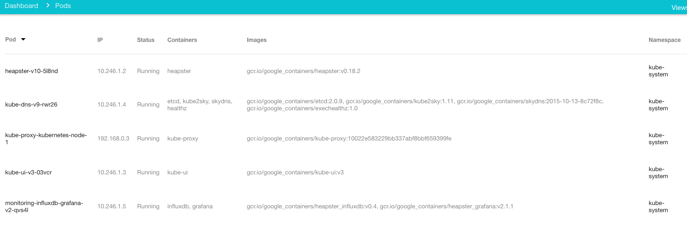

There are several ways of bringing up a kubernetes cluster. While obviously
the easiest one is to use GCE, that would’t be of much help if your goal is
to integrate it with some other technology, say, for instance, a network
virtualization controller; even more importantly, it’s not free, and that
$300 credit runs out very fast.

A quick look at the [getting started](http://kubernetes.io/gettingstarted/)
page reveals plenty of choices to deploy Kubernetes. Some of them are meant
for production environments, some for devtest environments, and some for both.
While it might be cool to deploy on Mesos or deploying on vSphere might have
a convenient enterprise-y flavor, here we will focus on deploying using vagrant.

Vagrant, for those who have been living under a rock in recent years, is a very
convenient tool for provisioning and managing developer environments.
These provisioning engines leverage providers, which can be regarded as the drivers
executing vagrant commands.

Well known providers include VirtualBox, VMware (for Fusion and Workstation),
Hyper-V, and Docker; there is also a libvirt provider. Furthermore, there is an
[OpenStack provider](https://github.com/ggiamarchi/vagrant-openstack-provider),
which makes it possible to spin up development environments directly on
OpenStack clouds. The purpose of this garbled collection of words tries to
discuss how to achieve this.

But first, let’s start with building kubernetes…

##  Building Kubernetes

This is fairly simple and straightforward. Just follow the
[instructions](https://github.com/kubernetes/kubernetes/tree/master/build/README.md),
and off you go.

Once all the prerequisites are installed, the simplest way of building
Kubernetes is to run `./build/release.sh` - This script will:

* run a container for building kubernetes (it will also build the container
image if necessary) compile go source code
* run unit and integration tests (this take quite some time, skip by setting
`KUBE_RELEASE_RUN_TESTS=n`)
* create release tarballs

While there might be many caveats when using an interpreted language like
Python, skipping the compiler stage is surely convenient. For instance, in
the OpenStack world one usually just needs to restart the process after
modifying the code. This is not possible for Kubernetes and the build process
is unfortunately not super fast. Build times varies with number of CPUs and
memory, but the first build on a machine with 4vCPUs and 8GB RAM takes roughly
18 minutes. Subsequent builds are thankfully faster. The build process can be
made faster by increasing available RAM, or building only for certain
platforms. Building only for linux/amd64 on the same machine as before can
reduce build time to something between 4 and 5 minutes.

Once the build process completes deliverables are available in the
`$KUBE_ROOT/_output` directory. Among the other things the `release-tars`
directory contains tarballs for server and client components. These tarballs
will be copied to master and minion nodes during provisioning.

### The Vagrant provider for Kubernetes

Vagrant is a very convenient way to set up development environments for
Kubernetes. A thorough guide to running Kubernetes with Vagrant is
available on [Kubernetes documentation]
(http://kubernetes.io/v1.1/docs/getting-started-guides/vagrant.html)

In a nutshell, the developer workflow looks like something like the following:

* Build kubernetes from sources
* Bring up the cluster with Vagrant:

```bash
$ export KUBERNETES_PROVIDER=vagrant
$ $KUBE_ROOT/cluster/kube-up.sh
```
* Wait for provisioning to complete
* Do changes to code and recompile
*Update the cluster with Vagrant:

```bash
$ $KUBE_ROOT/cluster/kube-push.sh
```

When bringing up a cluster Vagrant configures a “master” and one or more
“minion” nodes. The number of minion nodes can be controlled using the
`NUM_MINIONS` environment variable.

While Vagrant takes care of bringing up the nodes and starting the
configuration process, most of the actual configuration is done by
the provisioning scripts in `$KUBE_ROOT/cluster/vagrant`; these scripts
heavily use salt and ansible. How salt is employed to configure Kubernetes
clusters is extensively discussed in [Kubernetes documentation]
(http://kubernetes.io/v1.1/docs/admin/salt.html)

The provisioned cluster uses [flannel](https://github.com/coreos/flannel)
to create an overlay network among pods. This is a flat network shared by
all pods.

The Vagrant provisioning process configures a cluster where both nodes run
the kubelet as a system service, the master also runs kube-addons, the addons
object manager.
Moreover the API server, the controller manager, and etcd run on the master
node as docker containers; on the other hand the kube-proxy service obviously
runs on the minion only.

A few pods are also running in the system namespace:

```bash
$ kubectl get-pods --all-namespaces
NAMESPACE     NAME                                   READY     STATUS    RESTARTS   
kube-system   heapster-v10-2b952                     1/1       Running   0          
kube-system   kube-dns-v10-4le5i                     4/4       Running   0          
kube-system   kube-proxy-kubernetes-node-1           1/1       Running   0          
kube-system   kube-ui-v4-quck6                       1/1       Running   0          
kube-system   monitoring-influxdb-grafana-v2-m04pf   2/2       Running   0          
```

These pods correspond to the services returned by kubectl cluster-info:

```bash
Kubernetes master is running at http://localhost:8080
Heapster is running at http://localhost:8080/api/v1/proxy/namespaces/kube-system/services/heapster
KubeDNS is running at http://localhost:8080/api/v1/proxy/namespaces/kube-system/services/kube-dns
KubeUI is running at http://localhost:8080/api/v1/proxy/namespaces/kube-system/services/kube-ui
Grafana is running at http://localhost:8080/api/v1/proxy/namespaces/kube-system/services/monitoring-grafana
InfluxDB is running at http://localhost:8080/api/v1/proxy/namespaces/kube-system/services/monitoring-influxdb
```

The role of each of this system pods is outside the scope of this document;
however more information about these services can be retrieved just by
inspecting the pods with kubectl or the kube-ui itself, as shown in the
snapshot below:



**Note**: the kube-ui service may prompt for username and password; this
might be obvious, but to some dumber people like me it was not - the
credentials are `vagrant/vagrant`.

Finally it is important to keep in mind that the node does not register with
the API server using credentials but by using a token. On the master, tokens
are stored in `/srv/kubernetes/known_tokens.csv`; on the minion, the kubelet
service specifies the same token in the users section of the YAML file
`/var/lib/kubelet/kubeconfig`.

### The Vagrant OpenStack provider

A fork of the [vagrant-rackspace provider]
(https://github.com/mitchellh/vagrant-rackspace), the
[vagrant-openstack provider]
(https://github.com/ggiamarchi/vagrant-openstack-provider), allows for
provisioning and controlling machines in OpenStack clouds.

This provider works almost exactly like any other provider. The differences
are, obviously, boxes, and, needless to say, networking. With the OpenStack
provider boxes are as simple as json file, the OpenStack Image identifier is
indeed specified as a part of the customised VM properties; it is worth noting
that this behaviour unfortunately goes against Vagrant’s principle of
portability, but there does not seem to be any alternative, apart from having
uploading an image into Glance and use it as a box (which is not supported
anyway).

Networking is instead completely different. The Vagrant concepts of private and
public network are indeed deprecated, and network configuration must be
explicitly specified for VMs. The OpenStack Neutron networks to be used can be
specified either by name or id; an IP address can be optionally specified.
For instance the following configuration will result in a VM with two network
interfaces:

```json
 os.networks = [
    {
      name: 'meh-mgmt'
    },
    {
      id: '4077E358-F97F-4587-A222-B0297F879F5C',
      address: '192.168.0.99'
    }]
```

The Vagrant OpenStack provider uses the Neutron API to configure networking.
It is not clear whether there is an option for doing instance network
configuration when using nova-network.
 
**Note**: The choice to not use the vagrant-rackspace provider (developed by
the authors of Vagrant) is deliberate because of the differences between the
Rackspace API and the standard OpenStack APIs that most cloud implement (well
at least the one that was used here...)

### Deploying Kubernetes with Vagrant on Openstack

This is generally straightforward. However, due to its different nature,
doing so with the OpenStack provider presents some challenges, which require
some changes into the Kubernetes scripts for Vagrant provisioning.
All the code changes discussed in this section can be found
[here](https://github.com/salv-orlando/kubernetes)

#### Challenges and Solutions

##### Instance configuration

The process of launching an instance on OpenStack is quite different from
creating a VM in one of the environments where Vagrant usually operate, like
VirtualBox. To this aim, the Vagrant file needed special provisions for
specifying OpenStack instance parameters, such as flavor and image identifier.

```
    # Openstack provider configuration
     config.vm.provider :openstack do |v, override|
       config.ssh.username = 'fedora'
       config.ssh.private_key_path = '~/taturiello.pem'
       setvmboxandurl(override, :openstack)
       v.openstack_auth_url = ENV['OS_AUTH_URL']
       v.username = ENV['OS_USERNAME']
       v.password = ENV['OS_PASSWORD']
       v.tenant_name = ENV['OS_TENANT_NAME']
       v.flavor = ENV['FLAVOR']
       v.keypair_name = ENV['KEYPAIR']
       v.image = ENV['IMAGE_ID']
     end
```

All these parameters are stored in environment variables that can be sourced
before running `./kube-up.sh`. 

#### Instance networking configuration

Networking is the one aspect where the OpenStack provider completely diverges
from the standard Vagrant networking model. In order to address this behaviour,
a routine for customising network configuration has been added to the
Vagrantfile.


```ruby
  def prepare_vm_network(config, ip_address)
    # All the providers but openstack use the same configuration
    config.vm.network "private_network", ip: "#{ip_address}"

    # Openstack provider configuration
    config.vm.provider :openstack do |v, override|
      v.floating_ip_pool  = ENV['OS_FLOATINGIP_POOL']
      v.networks = [{id: ENV['OS_MGMT_NETWORK'],
                     address: ip_address}]
    end
  end
```

The `config.vm.network` setting is applied to every provider (it seems the
OpenStack one simply ignores it). Then customisation is performed for the
OpenStack provider only. It might have been possible to avoid setting 
`config.vm.network` for the OpenStack provider, but this was not done due to
author’s laziness and ignorance.
The routine above causes the OpenStack instance to be launched with a single
network interface with a specified IP address, and assigns a floating IP to
said instance.

`OS_MGMT_NETWORK` is the identifier of a tenant network which must be connected
to a router up linking to the external network `OS_FLOATINGIP_POOL`.

This network configuration differs from the ones Vagrant creates for the other
providers as it results in instance with a single network interface. Again,
there is no strong technical reason for this divergence, which is exclusively
due to the author’s laziness.

#### Guest network configuration

Vagrant expects to work with boxes that are mode for Vagrant. Unfortunately
this is not the case (in general) with OpenStack. In theory, it should be
possible to upload a Vagrant box to Glance and boot it. However, since this
failed miserably in the author's experiments with the Vagrant Fedora21 libvirt
box for running Kubernetes, the only other option was to tweak the provisioning
process to work with any Fedora21 box.

To this aim a simple change to `provision_node.sh` (and `provision_master.sh`)
enable a new environment variable called `MGMT_INTERFACE`. When such variable
is specified the parsing of the `ifcfg-ethX` files does not occur at all.

**Note**: while in theory it could be possible to simplify this process by
using DHCP, this will require non-trivial changes in provisioning scripts.
Therefore in this case consistency across providers is more important than
simplicity and static addressing is performed.

#### Salt installation

As stated elsewhere in this document, SaltStack is used a bit everywhere when
deploying kubernetes clusters, unless - of course - the cluster is deployed
manually or with 3rd party scripts that do not leverage SaltStack.
For this reason the box which is normally used with libvirt and VirtualBox
comes with salt-master and salt-minion service already installed.

Unfortunately this is not the case for the fedora image that was used in this
experiment. Rather than tweaking the image adding the missing package, it is
easier to modify the provisioning scripts so that salt is properly installed.

This actually required a little refactoring, if nothing else to ensure
salt-master is installed only on the master node.

#### Example

As launching a Kubernetes cluster on OpenStack requires the use of resources
in the Openstack cloud, it is unfortunately necessary to pass the identifier
of those resource to the kube-up.sh script.

Before launching kube-up it is therefore necessary to:

 * Setup environment variables for accessing the OpenStack cloud

```bash
export OS_AUTH_URL=https://10.34.210.200:5000/v2.0
export OS_NETWORK_URL=https://10.34.210.200:9696/v2.0
export OS_TENANT_ID=abc123abc123abc123abc123abc123ab
export OS_TENANT_NAME="supermeh"
export OS_USERNAME=”meh"
export OS_PASSWORD="1D0ntC@re"
export OS_REGION_NAME="MEH"
```
Setup environment variables pertaining the cloud resources the Kubernetes cluster needs to use. For instance image identifier, network identifier, flavor name, and keypair name.

```bash
export KUBERNETES_PROVIDER=vagrant
export VAGRANT_DEFAULT_PROVIDER=openstack
export MGMT_INTERFACE="eth0"
export MASTER_IP="192.168.0.2"
export NODE_IP_BASE="192.168.0."
export OS_KEYPAIR="meh_keypair"
export OS_FLAVOR="vanilla_ice"
export OS_IMAGE_ID="abcdef12-a1b2-f0e9-aaaa-caffe00001111"
export OS_FLOATINGIP_POOL="1fe20c49-1e6f-45e1-9735-7ab00864a5c1"
export OS_MGMT_NETWORK="38ac7744-d52e-4b68-994a-879cb001coo1"
```

Once this variables are set execute (from `$KUBE_ROOT`):
`./cluster/kube-up.sh`

...and hope that everything goes smoothly.

After a few minutes your cluster should be correctly configured; the first
run is always significantly slower as the whole contents of the `_output`
directory are copied over to the master and minion instances, using the
relatively slower rsync protocol. Unfortunately the Vagrant OpenStack 
provider does not support NFS.

### Caveats and Notes

As you might expect, this document is the result of a long-ish trial and
error process. The following information might help in order to avoid any
issue, or at least be able to do some form of troubleshooting.

* Instances might fail to boot and kube-down complains that an instance was
deleted using other means such as horizon or the OpenStack CLI. This is
actually the Vagrant Openstack provider complaining, and for no good reason.
A workaround for this buggish behaviour is to go to
`$KUBEROOT/.vagrant/machines` and remove the directory for the machine that
failed to boot.
* Also, the cleanup process seems to leak ports. This means that IP addresses
are not freed upon failures. Therefore subsequent boots will fail and the VM
will be in ERROR status; Nova doesn't do a great job in letting the user know
what has gone wrong, but this is all Neutron’s fault. So - if the provisioning
process fails, ensure you do some cleanup before trying again.
* The Vagrant provisioning script complains that salt services are not running.
This has been witnessed a few times; however when logging into the failed instance
the services were running. It is likely a race condition in the provisioning
script, that can be sorted by running `./cluster/kubne-push.sh` - if that
happens while booting a node different from the master see the next bullet.
* Node provisioning fails and after resuming with kube-up or kube-push the
kubelet cannot register with the master - the reason for the error is
“the master asked for credentials” (how rude!). This happens because the
token, is generated each time the provisioning scripts are running, hence
master and minion end up using two different tokens.
This issue can be worked around by extracting the correct token from the
master (`/srv/kubernetes/known_tokens.csv`), and writing it into each minion in
`/var/lib/kubelet/kubeconfig`.
* rsync synchronisation is a pain. It can take ages, unless one acts smart with
the `_output` directory. The default build process generates deliverables for
platforms that are clearly not going to be used in this cluster, and likely not
even by the clients that will be employed. As of January 2016 the contents of
this directory, after running `./build/release.sh` used up roughly 7GB of data.
In order for this cluster to work this amount could be reduced consistently by
removing the `release-stage` directory and all the tars for targets which are
not linux-amd64 from the `release-tars` directory. Some cleanup can be
performed also on the `dockerized` directory, even if the provisioning process
seems to need some of those binaries (kubectl at least).
* ssh into vagrant instances can be slow. This is no big deal as it’s the usual
issue with reverse DNS lookup (on the server side) or GSSAPI authentication
(on the client side). This [article](http://ask.xmodulo.com/fix-slow-ssh-login-issue-linux.html)
explains how to dealt with the issue.
* Rebuilding kubernetes from sources is not very fast, as it might easily end up
taking 10 minutes. It is important to take steps to completely avoid building
platforms that are not used and improve the process of building containerised
images. While this is not difficult, it does not fall into this scope of this
thread. Anyway undesired deliverables can also be added once the build completes.

### Conclusions

Automating the development process in this way allows for doing code
development on a single host, push the changes everywhere and then do tests by
exercising the master directly.
It is also a fun way of doing code development on rather complex infrastructure.

On the other hand, while Vagrant is awesome, using it with the OpenStack
provider is not as awesome as using it with virtualbox or libvirt, as there
are many round trips to OpenStack service endpoints which slow down a bit the
whole process. Also, rsyncing the _output directory can be a painful process,
as every code change will cause the whole new release tar to be uploaded 
and installed).

As a developer whose machines live in an OpenStack cloud there is a trade-off
between having a “fast” development environment where k8s nodes are actually
slow and limited because of nested virtualization (this won’t apply if you run
OpenStack baremetal), and a rather clunky development environment that can
however spin k8s nodes that are similar in nature to those one can spin on GCE or AWS.
